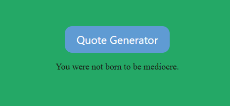
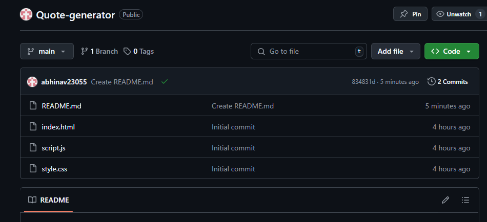

# Quote Generator 🔮

A simple yet elegant Quote Generator web app built using HTML, CSS, and JavaScript. Every time you click the button, a new random quote is displayed to inspire, motivate, or amuse!

## 🚀 Live Demo

Check out the live version here:  
👉 [https://abhinav23055.github.io/Quote-generator/](https://abhinav23055.github.io/Quote-generator/)

## 🔍 Project Preview

## 📁 Repository View

## 🛠️ Technologies Used

- **HTML** – Structure of the web page  
- **CSS** – Styling and visual design  
- **JavaScript** – Logic for generating random quotes  

## 📂 Project Structure

Quote-generator/ ├── index.html # Main HTML file ├── style.css # Styling for the page ├── script.js # JavaScript logic for quotes └── README.md # Project description and info

## ✨ Features

- Randomly displays a new quote with each button click  
- Smooth hover effects on the button  
- Responsive and clean design  
- Easily customizable – you can add or change quotes in `script.js`

## 📌 How to Use Locally

1. Clone the repository:
git clone https://github.com/abhinav23055/Quote-generator.git

2. Open `index.html` in your browser.
3. Click the "Quote Generator" button to see a random quote.

## 💡 Future Improvements

- Add author names to quotes  
- Include quotes from an API (like [Quotable.io](https://github.com/lukePeavey/quotable))  
- Add share to Twitter functionality  
- Dark mode toggle

## 👨‍💻 Author

**Abhinav Gupta**  
2nd Year BCA Student at Delhi Technical Campus  
Front-End Developer in progress 🚀

---

Feel free to contribute or fork this project!

